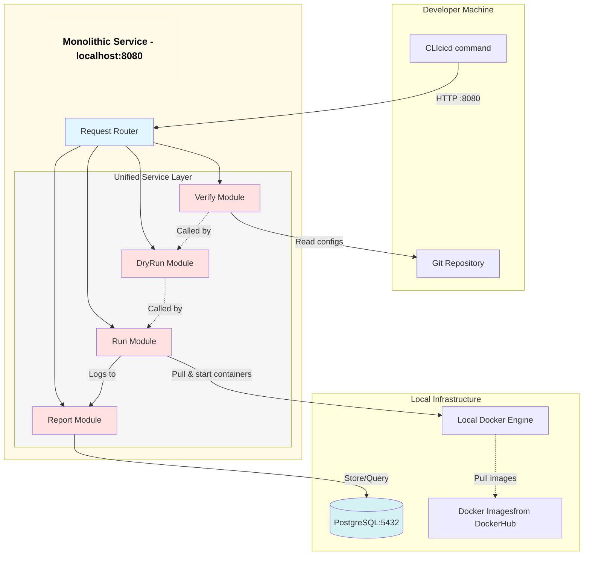
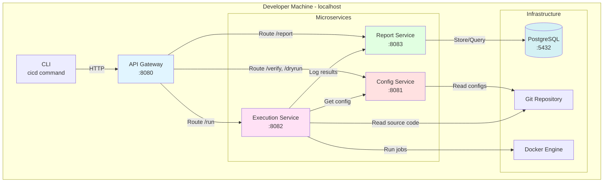

# Alternative Designs Considered

## Alternative 1: Monolithic Architecture

### Description

In the initial design phase and sprint 1, we considered a **monolithic architecture** where all functionalities of configuration validation (`verify`), dry-run execution (`dryrun`), pipeline execution (`run`), and reporting (`report`), would be implemented within a single service.



In this design, all components would exist as modules within a single application:
- **Single codebase**: All validation, execution, and reporting logic in one repository
- **Single deployment unit**: One JAR file, one process, one port (8080)
- **Direct method calls**: Internal communication via function calls rather than HTTP/REST
- **Shared resources**: Common database connection pool, shared configuration, unified logging
- **Tight coupling**: All modules running in the same JVM with shared memory space

### Pros and Cons

#### Pros

1. **Simplicity**: 
   - Single codebase to understand and navigate
   - No network communication overhead between components
   - Straightforward debugging with single process attachment
   - Simple deployment model (one JAR to distribute)

2. **Development Speed (Initially)**:
   - Faster initial development without service boundaries
   - No need to define inter-service APIs early
   - Easy refactoring across module boundaries
   - Shared utilities and common code readily accessible

3. **Performance**:
   - No network latency for inter-component communication
   - Direct memory access between modules
   - Single database connection pool to manage
   - Lower resource overhead (one JVM vs. multiple)

4. **Operational Simplicity**:
   - One process to start/stop
   - Single log file to monitor
   - Simpler dependency management
   - Easier transaction management across operations

#### Cons

1. **Scalability Limitations**:
   - Cannot scale individual functions independently
   - All components must scale together even if only one experiences high load
   - Resource-intensive operations (like `run`) would impact lightweight operations (like `verify`)
   - No ability to deploy multiple instances of specific functionality

2. **Tight Coupling**:
   - Changes in one module could break others unexpectedly
   - Difficult to maintain clear boundaries over time
   - Shared state management becomes complex
   - Risk of creating "spaghetti code" with cross-module dependencies

3. **Deployment Challenges**:
   - Must redeploy entire application for any change
   - Higher risk of downtime during deployments
   - Difficult to roll back individual features
   - Testing requires full system deployment

4. **Technology Lock-in**:
   - All modules must use the same programming language (Java)
   - Cannot optimize individual services with different technologies
   - Same JVM version requirements across all functionality
   - Limited ability to experiment with new approaches

5. **Development Team Friction**:
   - Multiple developers working on same codebase increases merge conflicts
   - Harder to assign clear ownership of components
   - Coupled release cycles slow down iteration
   - Difficult to parallelize feature development across team members

6. **Limited Flexibility for Phase 2**:
   - Moving to remote deployment would require significant refactoring
   - Cannot selectively move components to cloud (all-or-nothing)
   - Difficult to implement hybrid local/remote scenarios

### Why We Did Not Select This Design

While the monolithic design offered initial simplicity and faster early development, **the team rejected this approach** after carefully weighing the pros and cons against our design goals and long-term vision.


#### Phase 2 Migration Concerns

The most significant concern was the **Phase 2 transition**. While a monolith might work for Phase 1 (local execution), transitioning to Phase 2 (remote deployment) would require:
- Complete architectural refactoring to separate services
- Rewriting all inter-module communication to use REST/HTTP
- Redesigning shared state management
- Potentially rewriting significant portions of the codebase

This contradicted our goals: "*Support both local and remote execution*" and "*Services can be scaled independently*". Starting with a monolith would make Phase 2 a painful rewrite rather than a smooth deployment change.

#### Scalability and Performance Trade-offs

Although the monolith offered better performance through direct method calls (Pro #3), it failed to address real-world usage patterns:
- **Unbalanced load**: The `verify` command might be called frequently during development, while `run` is less frequent but resource-intensive
- **Resource contention**: Heavy pipeline executions would slow down simple validation checks
- **No horizontal scaling**: Cannot add more capacity for execution without also scaling validation and reporting

The inability to scale components independently (Con #1) was deemed a critical limitation that outweighed the performance benefits of in-process communication.

#### Team Development Velocity

While initial development might be faster (Pro #2), we recognized that **long-term velocity would suffer** (Con #5). Our team structure benefits from:
- Clear service ownership and bounded contexts
- Parallel development streams without merge conflicts
- Independent release cycles for different features
- Ability to iterate quickly on one service without impacting others

The monolithic approach's development friction would compound over time, especially as the team grows or as multiple features are developed simultaneously.

#### Architectural Flexibility

The monolith's technology lock-in (Con #4) conflicted with our desire to optimize each service appropriately:
- The Execution Service might benefit from different JVM tuning than the Report Service
- Future enhancements might benefit from different technology choices
- Cannot experiment with alternative implementations without risk

Most critically, the microservices architecture provides **optionality**: we can always simplify deployment later, but refactoring from a monolith to microservices is extremely difficult.

#### Conclusion

The team concluded that while a monolithic design offered **short-term simplicity** (Pros #1, #2, #4), the **long-term costs were unacceptable** (Cons #1, #2, #5, #6). The microservices architecture:
- Aligns with our core design goals
- Enables smooth Phase 1 → Phase 2 transition
- Provides scalability and flexibility from the start
- Supports parallel team development
- Gives us architectural options for the future

**The additional complexity of running multiple services locally (Phase 1) was deemed a worthwhile investment** to avoid a costly architectural rewrite later and to maintain consistency between local and remote execution models.

## Alternative 2: Three-Service Microservices Architecture with Config Service

### Description

During our design phase in Sprint 1, we considered a **three-service microservices architecture** where configuration validation and dryrun would be handled by a dedicated **Config Service**, separate from execution and reporting.


In this design, the system would be split into three independent microservices:
- **Config Service (Port 8081)**: Handles `verify` and `dryrun` commands, validates pipeline YAML files, manages pipeline configurations
- **Execution Service (Port 8082)**: Orchestrates pipeline execution, manages Docker containers, coordinates job runs
- **Report Service (Port 8083)**: Stores execution results, provides reporting and querying capabilities
- **API Gateway (Port 8080)**: Routes CLI requests to appropriate services

Each service would:
- Run as an independent process with its own port
- Have its own repository and deployment unit
- Communicate via REST APIs
- Operate with clearly defined responsibilities

### Pros and Cons

#### Pros

1. **Complete Service Separation**:
   - Config Service owns all validation logic with a clear API boundary
   - Each service has a single, well-defined responsibility
   - Clean separation of concerns across the entire system
   - RESTful APIs provide clear contracts between services

2. **Centralized Validation**:
   - All validation logic lives in one place (Config Service)
   - Consistent validation rules across all consumers
   - Easy to track validation metrics and performance
   - Other tools can use Config Service API for validation

3. **API-Driven Architecture**:
   - All operations accessible via HTTP APIs
   - Enables future integrations (webhooks, third-party tools, web UI)
   - Uniform interface for both local and remote execution
   - Well-suited for distributed teams and tooling ecosystems

4. **Independent Scalability**:
   - Can scale Config Service separately if validation becomes a bottleneck
   - Execution Service can scale based on pipeline load
   - Report Service can scale based on query patterns
   - Each service can be optimized independently

5. **Phase 2 Ready**:
   - Architecture identical for local and remote deployment
   - Moving to cloud is just changing where services run
   - No architectural changes needed between phases
   - Consistent behavior across environments

6. **Clear Service Ownership**:
   - Teams can own specific services
   - Changes to validation don't require touching execution code
   - Parallel development with minimal coordination
   - Well-defined API boundaries reduce coupling

#### Cons

1. **Network Overhead for Validation**:
   - Every `verify` or `dryrun` requires HTTP call to Config Service
   - Adds latency compared to local validation (10-50ms per call)
   - Requires Config Service to be running for simple checks
   - Network can become bottleneck for frequent validations

2. **Execution Service Dependency on Config Service**:
   - Execution Service must call Config Service to get pipeline configuration
   - Creates runtime dependency between services
   - If Config Service is down, Execution Service cannot start runs
   - Adds complexity to error handling and retries
   - Extra network hop in critical execution path

3. **Duplicate Git Access**:
   - Both Config Service and Execution Service need Git access
   - Config Service reads `.pipelines/*.yaml` files for validation
   - Execution Service reads entire repository for Docker mounting
   - Two services managing Git operations independently
   - Potential for version inconsistencies if they checkout different commits
   - **Note**: While CLI + shared library also needs Git (2 places), the key difference is:
     - **Three-service**: Two _services_ need Git (runtime infrastructure dependency)
     - **Two-service**: CLI + one service need Git (CLI is client-side, only Execution is infrastructure)
   - In Phase 2, the two-service model reduces to just Execution Service needing Git remote access

4. **Increased Infrastructure Complexity**:
   - Three services to manage instead of two (50% more)
   - Three ports to configure and monitor (8081, 8082, 8083)
   - More processes to start/stop during development
   - Higher resource usage (three JVMs vs. two)
   - More complex health checking and monitoring


5. **Slower Developer Feedback**:
   - `verify` and `dryrun` require services to be running
   - No offline validation capability
   - Slower feedback loop during development
   - Requires network connectivity for basic operations

6. **Operational Overhead**:
   - Additional service to deploy, monitor, and maintain
   - More logs to aggregate and search through
   - More configuration to manage (three application.yml files)
   - More endpoints to secure and version

### Why We Did Not Select This Design

While the three-service architecture offered a clean separation of concerns and a fully API-driven model, **the team rejected this approach** after analyzing the trade-offs and considering our actual usage patterns and requirements.

#### Config Service Adds Limited Value

The primary concern was that **Config Service doesn't provide sufficient value to justify its existence as a separate service**. Configuration validation is:
- **Stateless**: No database, no persistent state, pure computation
- **Lightweight**: YAML parsing and validation are fast operations
- **Deterministic**: Same input always produces same output

These characteristics make validation an ideal candidate for a **shared library** rather than a microservice. A library provides:
- Zero network latency (in-process calls)
- No runtime service dependency
- Works offline without infrastructure
- Same validation logic guaranteed across services

The Config Service essentially becomes a thin wrapper around validation logic that could be directly embedded, adding network overhead (Con #1) without meaningful benefits.

#### Developer Experience Degradation

The three-service model significantly **degrades the developer experience** (Con #5):
```bash
# Two-service model (chosen):
$ cicd verify .pipelines/default.yaml
✓ Instant feedback (offline)

# Three-service model (rejected):
$ cicd verify .pipelines/default.yaml
1. Wait for Config Service to be running...
2. Send HTTP request to localhost:8081
3. Wait for response (10-50ms)
4. ✓ Feedback

# If Config Service not running:
ERROR: Connection refused to localhost:8081
```

Developers want **instant feedback** during development. Requiring services to be running for basic validation checks creates unnecessary friction. The two-service model with local validation provides:
- Sub-millisecond validation feedback
- Offline capability (no network required)
- No service startup dependencies
- CLI works immediately without infrastructure


#### Runtime Service Dependency

The Execution-to-Config dependency (Con #2) introduces unnecessary coupling and failure modes:
```java
// Three-service model - runtime dependency:
public void runPipeline(String name) {
    // Must call Config Service (network, can fail)
    PipelineConfig config = configServiceClient.getPipeline(name);
    if (config == null) {
        throw new ServiceUnavailableException("Config Service down");
    }
    // Execute...
}

// Two-service model - library call:
public void runPipeline(String name) {
    // Direct library call (in-process, cannot fail due to network)
    File yamlFile = git.getFile(".pipelines/" + name + ".yaml");
    PipelineConfig config = yamlValidator.validate(yamlFile);
    // Execute...
}
```

The three-service model adds a network call in the **critical execution path**, creating:
- Additional latency before jobs can start
- New failure mode (Config Service unavailable)
- Retry logic and timeout handling complexity
- Monitoring for inter-service health

These costs are unnecessary when Execution Service can read Git directly and validate using a shared library.

#### Increased Operational Burden

Managing three services instead of two (Con #4) increases overhead by 50%:
```bash
# Three-service startup:
$ docker-compose up gateway config-service execution-service report-service db

# Managing three application configs:
config-service/application.yml
execution-service/application.yml
report-service/application.yml

# Three service health checks:
curl localhost:8081/health  # Config
curl localhost:8082/health  # Execution
curl localhost:8083/health  # Report

# Three services' logs to monitor:
tail -f logs/config-service.log
tail -f logs/execution-service.log
tail -f logs/report-service.log
```

For a **learning project** and **Phase 1 local development**, this overhead provides minimal benefit. The operational complexity detracts from the core learning objectives around Docker orchestration, pipeline execution, and result reporting.

#### Pragmatic Microservices Philosophy

Our decision reflects a **pragmatic approach to microservices**: 

> "Use microservices where they add value, not everywhere."

Microservices should solve real problems:
- **Execution Service**: Solves complex orchestration, needs independent scaling for heavy workloads
- **Report Service**: Solves different data access patterns, read-heavy vs. write-heavy separation

Config Service doesn't solve a problem that can't be better solved by a shared library. Creating a service just to have "more microservices" violates the principle of **simplicity** and **pragmatic design**.

#### Comparison Table

| Aspect | Three Services (Config + Exec + Report) | Two Services (Exec + Report) |
|--------|----------------------------------------|------------------------------|
| **Validation Speed** | 10-50ms (network call) | <1ms (library call) |
| **Offline Capability** | ❌ No (needs Config Service) | ✅ Yes (local validation) |
| **Service Count** | 3 services, 4 processes | 2 services, 3 processes |
| **Execution Dependency** | Runtime (Config Service API) | Compile-time (shared library) |
| **Developer Experience** | Must start services for verify | Instant CLI validation |
| **Git Access** | Config + Execution both need it | Only Execution needs it |
| **Validation Logic** | Centralized in service + duplicate for security | Shared library (single source of truth) |
| **Failure Modes** | Config Service down blocks execution | Fewer points of failure |
| **Phase 2 Transition** | Same architecture | CLI still validates locally (optional) |

### Conclusion

The three-service architecture with Config Service represents **over-engineering for our use case**. While it provides:
- API-driven validation (Pro #3)
- Complete service separation (Pro #1)
- Phase 2 readiness (Pro #5)

It introduces significant drawbacks:
- Network overhead for lightweight operations (Con #1)
- Degraded developer experience (Con #5)
- Unnecessary runtime dependencies (Con #2)
- Higher operational complexity (Con #4)

**The team concluded that a shared validation library** provides all the benefits of centralized validation logic without the costs of a separate service:
- ✅ Single source of truth for validation rules
- ✅ Zero network latency
- ✅ Works offline
- ✅ No runtime service dependencies
- ✅ Simpler architecture with fewer moving parts

The two-service model (Execution + Report) focuses microservices on areas with genuine architectural benefits:
- **Execution Service**: Complex orchestration, heavy workloads, needs scaling
- **Report Service**: Different data patterns, read-heavy queries, async processing

This aligns with our core principle: **"Microservices should solve real problems, not create artificial ones."** Config Service would be an artificial service solving a problem better addressed by a shared library.

**Our chosen architecture balances microservices benefits with pragmatic simplicity**, optimizing for developer experience, operational simplicity, and genuine architectural needs.