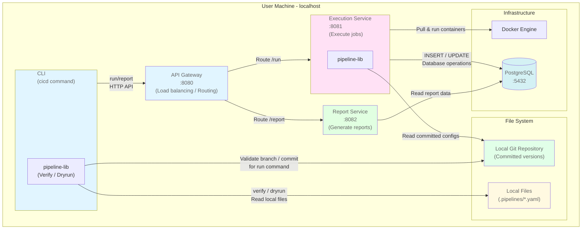
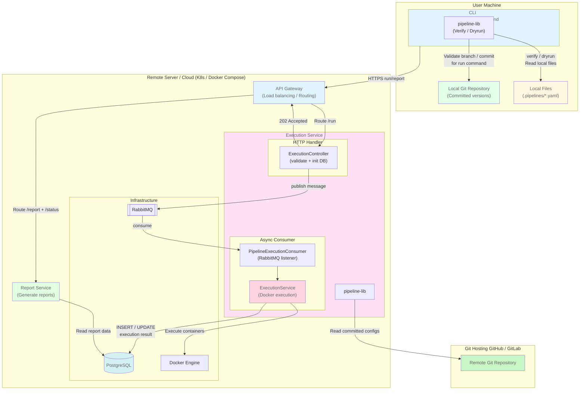
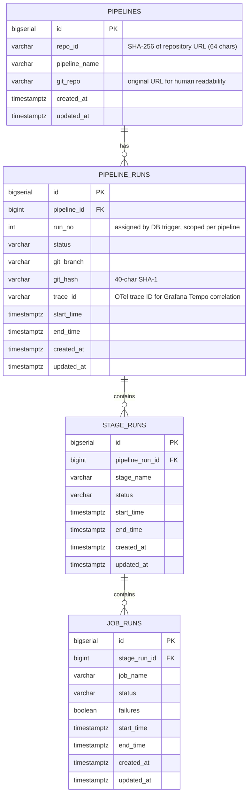
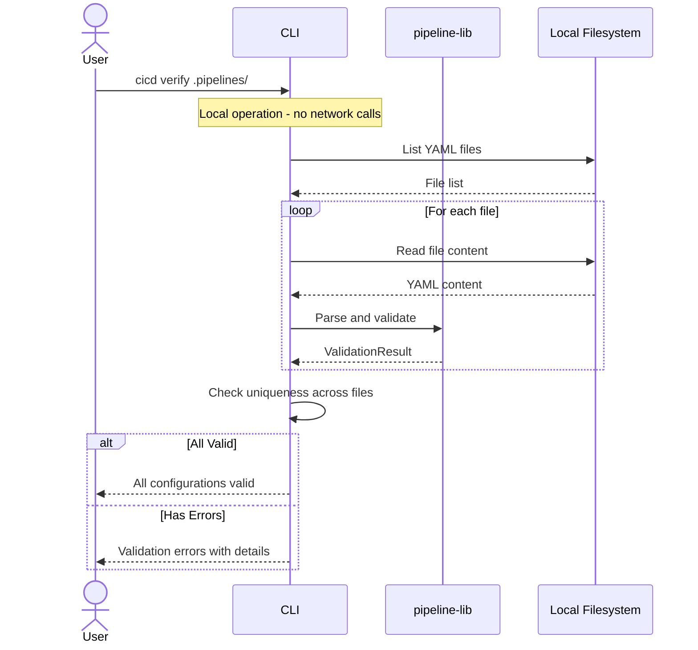
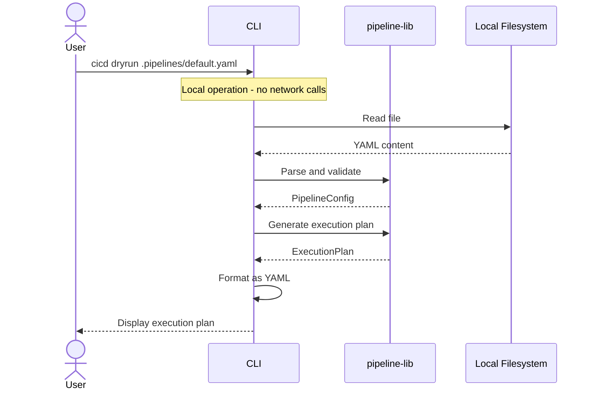
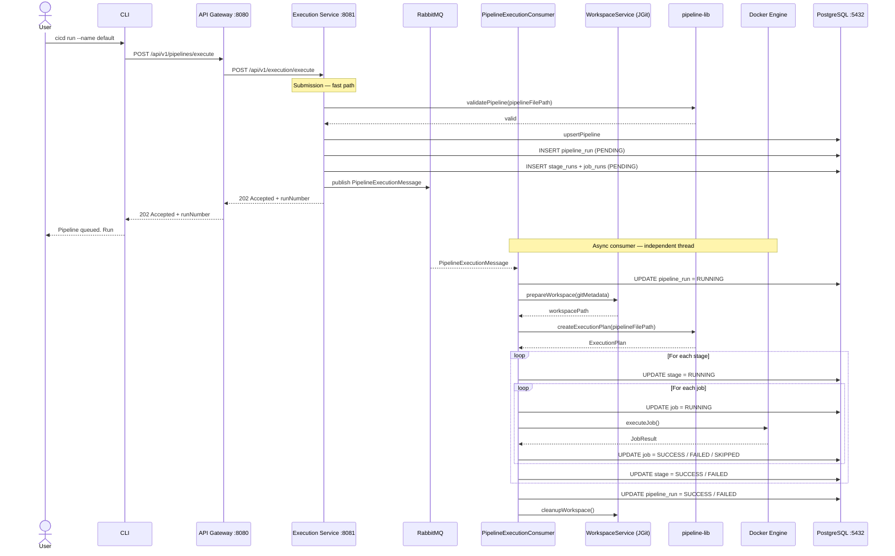
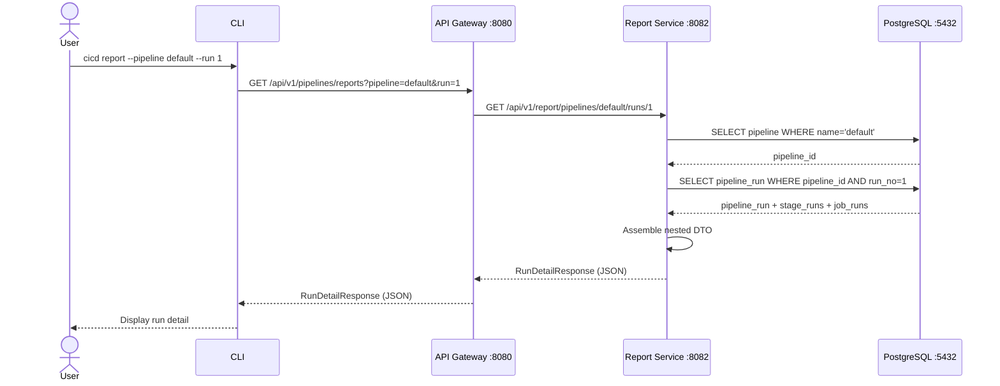

# CI/CD System - Design Documentation

## Table of Contents

1. [Overview](#overview)
2. [Architecture Overview](#architecture-overview)
3. [System Components](#system-components)
4. [Observability Stack](#5-observability-stack)
5. [Data Model](#data-model)
6. [Key Workflows](#key-workflows)
7. [Configuration Validation](#configuration-validation)
8. [Error Handling](#error-handling)
9. [Deployment Models](#deployment-models)

---

## Overview

This document describes the design and architecture of a custom CI/CD system built with a **microservices architecture
**. The system enables developers to run pipeline configurations locally and remotely, supporting YAML-based pipeline
definitions, Docker container execution, and comprehensive reporting capabilities.

### Design Goals

- **Local-first execution**: Enable developers to run pipelines on their local machines
- **Git-native**: All configuration resides in the repository
- **Docker-based**: Jobs run in isolated Docker containers
- **Microservices architecture**: Scalable, independent services
- **Asynchronous execution**: Non-blocking pipeline execution
- **Simple and maintainable**: Avoid unnecessary complexity
- **Flexible reporting**: Track and query pipeline execution history
- **Phase-based development**: Support both local and remote execution
- **Observability**: Distributed tracing, metrics, and structured log aggregation across all services

### Architecture Philosophy

This system uses a **microservices architecture** where:

- Each service has a single, well-defined responsibility
- Services communicate via REST APIs and message queues
- Services can be scaled independently
- Services can be developed and deployed independently
- CLI is a client tool, not a system component
- **Asynchronous execution**: Pipeline submissions return `202 Accepted` immediately; a RabbitMQ consumer handles actual
  execution
- **Shared database**: Both Execution and Report services access the same PostgreSQL database
- **Clear data ownership**: Execution Service writes data, Report Service reads data
- **Simplicity over complexity**: Direct database access for better performance

**Development Phases:**

- **Phase 1**: All microservices run locally (localhost, different ports)
- **Phase 2**: All microservices run remotely (cloud/server, same architecture) with full-stack observability (distributed tracing, metrics, structured log aggregation)

**Note:** The CLI is considered a client tool and runs on the developer's machine in both phases.
---

## Architecture Overview

### Port Allocation

| Service                  | Port  | Purpose                                     |
|--------------------------|-------|---------------------------------------------|
| API Gateway              | 8080  | Main entry point for CLI                    |
| Execution Service        | 8081  | Pipeline execution and Docker orchestration |
| Report Service           | 8082  | Query and report generation                 |
| PostgreSQL               | 5432  | Persistent data storage                     |
| RabbitMQ (AMQP)          | 5672  | Async message queue for pipeline execution  |
| RabbitMQ Mgmt UI         | 15672 | RabbitMQ management console                 |
| Grafana                  | 3000  | Unified observability dashboards            |
| Prometheus               | 9090  | Metrics storage and query                   |
| Loki                     | 3100  | Log aggregation                             |
| Tempo                    | 3200  | Distributed trace storage                   |
| OTel Collector (gRPC)    | 4317  | OTLP signal ingestion from services         |
| OTel Collector (HTTP)    | 4318  | OTLP signal ingestion from services         |

### Phase 1: Local Microservices



**Key Characteristics:**

- 2 core microservices (Execution + Report)
- CLI performs local validation (verify/dryrun) by calling pipeline-lib directly — no network calls
- CLI performs remote operations (run/report) through the API Gateway
- **Synchronous execution**: API holds the connection open until the pipeline completes and returns the full result
- **Shared database**: Both services access PostgreSQL
- **Clear data ownership**: Execution writes, Report reads
- All services on localhost (different ports)
- Easy debugging (attach to any service)
- Fast development cycle

### Phase 2: Remote Microservices

Same architecture, deployed to remote infrastructure.



**Key Characteristics:**

- CLI performs local validation by calling pipeline-lib directly
- CLI performs remote operations (`run`, `status`, `report`) through the API Gateway
- **Asynchronous execution**: `POST /execute` returns `202 Accepted` immediately; RabbitMQ consumer runs the pipeline
  independently
- Deployed to cloud/remote servers (Docker Compose or Kubernetes via Helm)
- **Horizontally scalable**: Multiple Execution Service instances each consume from the shared RabbitMQ queue
- **Shared database**: Both services access same PostgreSQL instance
- **Durable queue**: RabbitMQ exchange and queue survive broker restarts

---

## System Components

### 1. CLI (Command Line Client)

**Responsibility:** User-facing interface for all CI/CD operations

**Technology:** Java + Picocli

**Sub-commands:**

- `verify`: Validate pipeline configuration files (local execution)
- `dryrun`: Parse and display execution plan (local execution)
- `run`: Submit pipeline for async execution (calls Execution Service, returns immediately with run number)
- `status`: Query live or most recent execution status (calls Report Service)
- `report`: Query full execution history (calls Report Service)

**Local Operations:**

The CLI performs `verify` and `dryrun` operations locally:

- Reads files directly from the local filesystem
- Uses the **pipeline-lib shared library** for parsing and validation — no network calls
- Provides immediate feedback without network calls
- Works offline (no network dependencies)
- Same validation logic as Execution Service (guaranteed consistency)

**Git Validation for Run Command:**

Before executing `run`, the CLI validates Git state:

- If `--branch` is specified: Check current branch matches
- If `--commit` is specified: Check current commit matches
- If mismatch detected: Exit with error (no automatic switching)
- Ensures only committed files are used (uncommitted changes ignored)

**Example validation:**

```bash
# Current state: branch=main, commit=abc123

cicd run --name default                    # OK: uses current state
cicd run --name default --branch main      # OK: matches current branch
cicd run --name default --branch feature   # ERROR: branch mismatch
cicd run --name default --commit xyz789    # ERROR: commit mismatch
```

**Remote Operations:**

- Phase 1: Talks to API Gateway at `http://localhost:8080`
- Phase 2: Talks to API Gateway at `https://cicd.example.com`

**Important: File Access vs Git Access**

The system has two different file access patterns:

1. **CLI Local Operations** (`verify`, `dryrun`):

    - Direct filesystem access
    - Reads `.pipelines/*.yaml` files as regular files
    - Fast, works offline
    - Used for validation and planning only
    - Calls pipeline-lib directly — no network call
2. **Execution Service** (`run`):

    - Git repository access via JGit
    - Reads committed versions: `git show HEAD:.pipelines/default.yaml`
    - Only considers committed files
    - Uncommitted local changes are ignored
    - Ensures reproducible builds

This separation ensures developers can validate configurations quickly while guaranteeing that actual execution uses
only committed, version-controlled code.

---

### 2. API Gateway

**Responsibility:** Single entry point for all client requests, routes to appropriate services

**Technology:** Spring Boot WebFlux with WebClient routing

**Port:** 8080 (local), 443/80 (remote)

**Key Functions:**

- Route requests to appropriate microservices
- Handle authentication/authorization (future)
- Rate limiting (future)
- Request/response logging
- API versioning

**Routing Table:**

| Endpoint                                               | Routes To         | Target URL                                               | Purpose                        |
|--------------------------------------------------------|-------------------|----------------------------------------------------------|--------------------------------|
| `POST /api/v1/pipelines/execute`                       | Execution Service | `http://execution-service:8081/api/v1/execution/execute` | Submit pipeline (202 Accepted) |
| `GET /api/v1/pipelines/status?repo=...`                | Report Service    | `http://report-service:8082/api/v1/status`               | Active/recent run for repo     |
| `GET /api/v1/pipelines/status/{pipeline}/runs/{runNo}` | Report Service    | `http://report-service:8082/api/v1/status/...`           | Live status for specific run   |
| `GET /api/v1/pipelines/report/...`                     | Report Service    | `http://report-service:8082/api/v1/report/...`           | Query execution history        |

**Configuration (application.yml):**

```yaml
spring:
  application:
    name: cicd-api-gateway

server:
  port: 8080

services:
  execution:
    url: ${EXECUTION_SERVICE_URL:http://localhost:8081}
  report:
    url: ${REPORT_SERVICE_URL:http://localhost:8082}
```

---

### 3. Execution Service

**Responsibility:** Execute pipelines by running jobs in Docker containers

**Technology:** Spring Boot WebFlux + Spring Data R2DBC + Docker Java Client + JGit

**Port:** 8081

---

#### Critical Architecture Principle

Execution Service **directly accesses the database** via R2DBC to write execution data. This provides:

- **Better performance**: No HTTP overhead for status updates
- **Non-blocking I/O**: R2DBC keeps the event loop free during all DB operations
- **Immediate updates**: Real-time status visibility in reports
- **Simpler code**: Direct reactive repositories instead of HTTP clients

```
Execution Service
      ↓
Direct Database Connection (R2DBC, reactive)
      ↓
PostgreSQL (SHARED)
      ↑
Report Service (Read-only)
```

**Data Access Pattern:**

- **Execution Service**: INSERT and UPDATE operations (writes)
- **Report Service**: SELECT operations only (reads)
- **No conflicts**: Clear ownership of write operations

---

#### Internal Architecture

```
Execution Service (Spring Boot WebFlux Application)
│
├── Controller Layer (REST API — fast path)
│   └── ExecutionController
│       ├── POST /api/v1/execution/execute
│       ├── Validates YAML, initialises DB records (PENDING), publishes to RabbitMQ
│       └── Returns 202 Accepted immediately with run number
│
├── Messaging Layer (async consumer)
│   ├── RabbitMQConfig
│   │   ├── Declares durable DirectExchange: pipeline.execution.exchange
│   │   ├── Declares durable Queue: pipeline.execution.queue
│   │   └── Configures Jackson2JsonMessageConverter
│   └── PipelineExecutionConsumer
│       ├── Listens on pipeline.execution.queue
│       ├── Clones workspace, re-parses YAML, drives ExecutionService
│       └── Marks run FAILED if consumer throws unexpectedly
│
├── Service Layer (Business Logic)
│   ├── ExecutionService
│   │   ├── Orchestrates sequential job execution
│   │   ├── Delegates DB writes to ExecutionPersistenceService
│   │   └── Offloads blocking Docker execution to Schedulers.boundedElastic()
│   ├── ExecutionPersistenceService
│   │   ├── Upsert pipeline definition row
│   │   ├── Create / update pipeline_runs, stage_runs, job_runs rows
│   │   └── Fail-open: DB errors produce warnings but never abort execution
│   └── WorkspaceService
│       ├── Clone repository via JGit (blocking — called on boundedElastic)
│       └── Cleanup workspace after execution (finally block)
│
├── Executor
│   └── DockerExecutor
│       ├── Runs each job in an isolated Docker container (blocking, synchronous)
│       └── Called on boundedElastic thread inside ExecutionService
│
└── Repository Layer (Reactive Data Access — R2DBC)
    ├── PipelineRepository      (CRUD on pipelines)
    ├── PipelineRunRepository   (CRUD on pipeline_runs)
    ├── StageRunRepository      (CRUD on stage_runs)
    └── JobRunRepository        (CRUD on job_runs)

External Dependencies:
├── pipeline-lib (Shared Library JAR)
│   ├── PipelineService         (createExecutionPlan)
│   ├── YamlParser
│   ├── CycleDetector
│   └── ExecutionPlanGenerator
└── RabbitMQ (message broker)
    └── pipeline.execution.queue (durable, survives broker restarts)
```

---

#### Execution Flow

The service uses an **async publish-subscribe pattern** via RabbitMQ. The HTTP handler returns immediately; a separate consumer drives actual execution.

```
── SUBMISSION (HTTP handler — fast path) ──────────────────────────────────────
POST /api/v1/execution/execute
  │
  ├─ [event-loop] Validate request (@Valid)
  ├─ [event-loop] PipelineService.validatePipeline()        ← parse + validate YAML
  ├─ R2DBC: upsertPipeline
  ├─ R2DBC: createPipelineRun  (status = PENDING)
  ├─ R2DBC: preCreateStagesAndJobs  (all rows as PENDING)
  ├─ RabbitMQ: publish PipelineExecutionMessage
  │
  └─ 202 Accepted  + runNumber                              ← returns immediately

── ASYNC CONSUMER (RabbitMQ listener — independent thread) ────────────────────
PipelineExecutionConsumer.consume(PipelineExecutionMessage)
  │
  ├─ R2DBC: updatePipelineRun  (status = RUNNING)
  ├─ [boundedElastic] WorkspaceService.prepareWorkspace()   ← blocking JGit clone
  ├─ PipelineService.createExecutionPlan()                  ← re-parse YAML
  │
  └─ ExecutionService.executeFromMessage()
        ├─ For each stage:
        │     ├─ markStageRunning
        │     ├─ For each job:
        │     │     ├─ Dependency check (canRun)
        │     │     ├─ markJobRunning
        │     │     ├─ DockerExecutor.executeJob()          ← blocking
        │     │     └─ updateJobRun (SUCCESS / FAILED / SKIPPED)
        │     └─ updateStageRun
        │
        ├─ R2DBC: updatePipelineRun  (SUCCESS / FAILED)
        └─ [finally] WorkspaceService.cleanupWorkspace()

  Error guard: if consumer throws, run is marked FAILED — never left in PENDING/RUNNING
```

---

#### Fail-fast Behaviour

If any job fails, all subsequent jobs within the pipeline are marked `SKIPPED`. Execution does not abort mid-loop —
every job always produces a result entry. Skipped jobs transition directly `PENDING → FAILED` without a `RUNNING`
transition.

---

#### Fail-open DB Writes

All database operations are delegated to `ExecutionPersistenceService`, which catches every exception internally. A DB
outage produces warning logs but never interrupts pipeline execution. When the DB is unavailable the pipeline still runs
and the returned `ExecutionResult` carries `runNumber=0`.

---

#### Component Relationships

```
ExecutionController
  │  @Autowired
  ├──► WorkspaceService          (blocking JGit — called on boundedElastic)
  └──► ExecutionService
         │  @Autowired
         ├──► ExecutionPersistenceService
         │      │  @Autowired
         │      ├──► PipelineRunRepository   (R2DBC)
         │      ├──► StageRunRepository      (R2DBC)
         │      └──► JobRunRepository        (R2DBC)
         └──► DockerExecutor                 (blocking — called on boundedElastic)

pipeline-lib (JAR, no Spring context)
  └── PipelineServiceFactory.create()        (called in ExecutionController constructor)
```

The HTTP handler publishes to RabbitMQ and returns immediately. The consumer drives the entire pipeline from clone to final DB write on an independent thread.

---

#### Thread Model

| Operation                                    | Thread                              |
|----------------------------------------------|-------------------------------------|
| HTTP request handling (submission)           | Netty event-loop (non-blocking)     |
| YAML validation + DB init + publish          | Netty event-loop / R2DBC pool       |
| RabbitMQ consumer dispatch                   | Spring AMQP listener thread pool    |
| JGit clone (`prepareWorkspace`)              | `boundedElastic`                    |
| YAML parsing (`createExecutionPlan`)         | Consumer thread                     |
| R2DBC queries (status updates)              | R2DBC connection pool thread        |
| Docker execution loop                        | `boundedElastic`                    |
| Workspace cleanup                            | `finally` block on consumer thread  |

---

#### API Contract

**Endpoint:** `POST /api/v1/execution/execute`

**Request body:** `PipelineExecutionRequest`

```json
{
  "pipelineName": "default",
  "pipelineFilePath": ".pipelines/default.yaml",
  "gitMetadata": {
    "repoUrl": "https://github.com/org/repo",
    "branch": "main",
    "commitHash": "abc1234..."
  }
}
```

**Response:** `PipelineExecutionResponse`

| HTTP Status                 | `status` field      | Condition                          |
|-----------------------------|---------------------|------------------------------------|
| `202 Accepted`              | `PENDING`           | Queued successfully                |
| `400 Bad Request`           | `VALIDATION_FAILED` | Pipeline YAML invalid              |
| `500 Internal Server Error` | `FAILED`            | Unexpected runtime error           |

> Use `GET /api/v1/status/{pipeline}/runs/{runNo}` (Report Service) to poll for `RUNNING`, `SUCCESS`, or `FAILED`.

---

#### Key Functions

- **`ExecutionController`**: Validates YAML, initialises DB records as PENDING, publishes `PipelineExecutionMessage` to RabbitMQ, returns 202 immediately.
- **`PipelineExecutionConsumer`**: RabbitMQ listener that drives the full execution lifecycle asynchronously. Marks run FAILED if it throws unexpectedly.
- **`RabbitMQConfig`**: Declares the durable exchange, queue, and binding; configures JSON message conversion.
- **`ExecutionService`**: Orchestrates sequential job execution; delegates all DB writes to `ExecutionPersistenceService`.
- **`ExecutionPersistenceService`**: All DB interactions. Fail-open design ensures a DB outage degrades gracefully rather than aborting execution.
- **`WorkspaceService`**: Clones the repository via JGit into a temporary directory; cleans it up in a `finally` block.
- **`DockerExecutor`**: Synchronous Docker API wrapper. Executed on `boundedElastic`.
- **`pipeline-lib`**: Parses the pipeline YAML into an `ExecutionPlan`. Used via `PipelineServiceFactory.create()` — no Spring context required.

---

#### Scaling Characteristics

- **Stateless**: No local state; safe to run multiple instances consuming from the same RabbitMQ queue
- **Async execution model**: HTTP handler returns immediately; execution is fully decoupled from the submission request
- **Horizontal scaling**: Multiple service instances each consume messages independently from RabbitMQ
- **Back-pressure**: RabbitMQ prefetch=1 limits each consumer to one in-flight pipeline at a time
- **I/O-bound**: Dominated by Docker pull/run times; DB and filesystem overhead is negligible

---

### 4. Report Service

**Responsibility:** Query and report on pipeline execution history

**Technology:** Spring Boot + Spring WebFlux + Spring Data R2DBC

**Port:** 8082

**Database:** PostgreSQL — **Read-only access** to shared database

**Critical Architecture Principle:**

Report Service has **read-only access** to the database. It only performs SELECT queries to generate reports.

```
         Report Service
              ↓
    Read-only Database Access (SELECT only, R2DBC)
              ↓
         PostgreSQL (SHARED)
              ↑
    Execution Service (Writes data)
```

**Data Access Pattern:**

- **Report Service**: SELECT operations only
- **Execution Service**: INSERT and UPDATE operations
- **Clear separation**: Report Service never modifies data
- **Consistency**: Always reads latest data written by Execution Service

**Architecture:**

```
Report Service
├── REST API Layer (Spring WebFlux)
│   └── ReportController
│       ├── Four report endpoints (pipeline / run / stage / job)
│       └── Health check endpoint
│
├── Service Layer
│   └── ReportService
│       ├── Resolves resource hierarchy reactively
│       │   (pipeline → run → stage → job)
│       └── Assembles nested DTO response objects
│
├── Repository Layer (Read-only, R2DBC)
│   ├── PipelineRepository      (SELECT on pipelines)
│   ├── PipelineRunRepository   (SELECT on pipeline_runs)
│   ├── StageRunRepository      (SELECT on stage_runs)
│   └── JobRunRepository        (SELECT on job_runs)
│
└── Exception Handling
    ├── ResourceNotFoundException  (→ HTTP 404)
    └── GlobalExceptionHandler     (→ HTTP 404 / 500)
```

**Key Functions:**

- **REST API Controller**: Receives report queries from CLI via API Gateway and delegates to `ReportService`. All
  endpoints are reactive and return `Mono<ResponseEntity<T>>`.
- **ReportService**: Resolves the full resource hierarchy top-down using reactive repository calls, emitting
  `ResourceNotFoundException` if any level is missing. Assembles results into nested DTO objects and formats timestamps
  as ISO 8601 strings.
- **Repository Layer**: Extends `ReactiveCrudRepository` (R2DBC). Spring Data derives all query implementations from
  method names — no manual SQL needed.

**API Endpoints:**

| Method | Endpoint                                                                     | Response DTO             | Purpose                                 |
|--------|------------------------------------------------------------------------------|--------------------------|-----------------------------------------|
| GET    | `/api/v1/status?repo={repoUrl}`                                              | `StatusResponse`         | Active/most recent run for a repository |
| GET    | `/api/v1/status/{pipeline}/runs/{runNo}`                                     | `StatusResponse`         | Live per-stage/job status for a run     |
| GET    | `/api/v1/report/pipelines/{pipeline}`                                        | `PipelineReportResponse` | All runs for a pipeline                 |
| GET    | `/api/v1/report/pipelines/{pipeline}/runs/{runNo}`                           | `RunDetailResponse`      | Run details with stages                 |
| GET    | `/api/v1/report/pipelines/{pipeline}/runs/{runNo}/stages/{stage}`            | `StageDetailResponse`    | Stage details with jobs                 |
| GET    | `/api/v1/report/pipelines/{pipeline}/runs/{runNo}/stages/{stage}/jobs/{job}` | `JobDetailResponse`      | Job details                             |
| GET    | `/api/v1/report/health`                                                      | `String`                 | Health check                            |

All endpoints return JSON. The CLI is responsible for formatting responses as YAML for display. HTTP 404 is returned
with a descriptive message when any resource in the hierarchy is not found.

**Resource Lookup Chain:**

`ReportService` resolves resources from the top down for each request:

1. `PipelineRepository.findByPipelineName(name)` → `Pipeline` → `pipeline_id`
2. `PipelineRunRepository.findByPipelineIdAndRunNo(id, runNo)` → `PipelineRun` → `pipeline_run_id`
3. `StageRunRepository.findByPipelineRunIdAndStageName(id, name)` → `StageRun` → `stage_run_id`
4. `JobRunRepository.findByStageRunIdAndJobName(id, name)` → `JobRun`

If any step returns empty, a `ResourceNotFoundException` is emitted with a message identifying exactly which resource
was missing (e.g. `"Stage 'build' not found in run 1 of pipeline 'default'"`).

**DTO Response Structure:**

JSON field names use hyphens (`run-no`, `git-repo`, `git-branch`, `git-hash`) via `@JsonProperty` to match the project
specification's report output format.

```
PipelineReportResponse
└── pipeline: { name, runs: [ RunSummary ] }
        RunSummary: run-no, status, git-repo, git-branch, git-hash, start, end

RunDetailResponse
└── pipeline: { name, run-no, status, start, end, stages: [ StageSummary ] }
        StageSummary: name, status, start, end

StageDetailResponse
└── pipeline: { name, run-no, status, start, end,
        stage: { name, status, start, end, jobs: [ JobSummary ] } }

JobDetailResponse
└── pipeline: { name, run-no, status, start, end,
        stage: { name, status, start, end,
            job: { name, status, start, end } } }
```

**Why R2DBC instead of JPA:**

The Report Service uses Spring WebFlux for fully reactive, non-blocking request handling. R2DBC provides a matching
non-blocking database driver, ensuring no thread-blocking occurs anywhere in the request path — from HTTP handler to
database query.

**Why Read-Only Access:**

- **Data integrity**: Cannot accidentally corrupt execution data
- **Performance**: Can use read replicas without affecting writes
- **Simplicity**: No transaction management needed
- **Security**: Database user granted SELECT permissions only
- **Caching**: Can aggressively cache without invalidation concerns

**Scaling Characteristics:**

- Stateless (read-only queries)
- Fully non-blocking (WebFlux + R2DBC)
- Read-heavy workload — can use database read replicas
- Horizontal scaling for high query load
- No write concerns or transaction conflicts

---

### 5. Observability Stack

All three microservices (API Gateway, Execution Service, Report Service) are instrumented with OpenTelemetry and emit traces, metrics, and structured logs to a shared collector.

**Signal flow:**

```
Services (OTel Java Agent + Logback Appender)
    │  OTLP (gRPC :4317 / HTTP :4318)
    ▼
OpenTelemetry Collector
    ├── traces  → Grafana Tempo  (:3200)
    ├── metrics → Prometheus     (:9090)  (remote write)
    └── logs    → Grafana Loki   (:3100)  (OTLP HTTP)
                        ▲
                        │  all three datasources
                   Grafana (:3000)
```

**Distributed Tracing (Tempo)**

- The OTel Java agent auto-instruments Spring WebFlux, RabbitMQ, and R2DBC
- Trace context is propagated end-to-end from CLI request through RabbitMQ consumer into Docker job container logs (MDC)
- Each pipeline run stores its `trace_id` in the `pipeline_runs` table (Flyway migration `V5__add_trace_id_to_pipeline_runs.sql`)
- `cicd report` output includes `trace-id` so a run can be located directly in Tempo

**Metrics (Prometheus)**

- The Execution Service emits custom counters and timers per pipeline, stage, and job via the OTel Metrics API
- API Gateway and Report Service expose standard Spring Boot / JVM metrics via Micrometer + OTel bridge
- The OTel Collector remote-writes all metrics to Prometheus

**Structured Logging (Loki)**

- All services install an OTel Logback appender (`OtelLogbackInstaller`) at startup to forward structured JSON logs via OTLP
- `DockerExecutor` streams container stdout/stderr to SLF4J with MDC fields (`pipeline`, `run_no`, `job`) so container logs land in Loki tagged `source=container`
- Logs are queryable in Grafana by pipeline name, run number, job name, or log level

**Grafana Dashboards** (`observability/grafana/dashboards/`)

| Dashboard | File | Description |
|-----------|------|-------------|
| Pipeline Overview | `pipeline-overview.json` | Aggregated run counts, success/failure rates, duration trends |
| Stage & Job Breakdown | `stage-job-breakdown.json` | Per-stage and per-job execution time and status |
| Logs Viewer | `logs-viewer.json` | Full-text log search across services and containers |
| Trace Explorer | `trace-explorer.json` | End-to-end trace search and waterfall view via Tempo |

Datasources (Prometheus, Loki, Tempo) and dashboards are auto-provisioned via `observability/grafana/datasources/` and `observability/grafana/dashboards/` on container startup. No manual Grafana setup is required.

---

## Data Model

### Entity Relationship Diagram



### Status Values

The `status` column is stored as `VARCHAR(50)` across all three run tables. Validation is enforced at the application
layer.

| Value               | Used By                             | Meaning                                    |
|---------------------|-------------------------------------|--------------------------------------------|
| `PENDING`           | stage_runs, job_runs                | Row pre-created; execution not started yet |
| `RUNNING`           | pipeline_runs, stage_runs, job_runs | Currently executing                        |
| `SUCCESS`           | pipeline_runs, stage_runs, job_runs | Completed successfully                     |
| `FAILED`            | pipeline_runs, stage_runs, job_runs | Failed or skipped due to prior failure     |
| `VALIDATION_FAILED` | API response only                   | Invalid YAML — never written to DB         |

**Notes:**

- `pipeline_runs` rows are inserted directly as `RUNNING` (never `PENDING`)
- `stage_runs` and `job_runs` are pre-created as `PENDING` before execution begins, so the full plan is immediately
  visible in reports
- Skipped jobs transition directly `PENDING → FAILED`, bypassing `RUNNING`

### Database Schema

The schema is managed by Flyway migration `V1__init_schema.sql`.

```sql
-- TABLE: pipelines
-- One row per (repo + pipeline name). repo_id is SHA-256 of git_repo URL.
CREATE TABLE pipelines
(
    id            BIGSERIAL PRIMARY KEY,
    repo_id       VARCHAR(64)   NOT NULL,
    pipeline_name VARCHAR(255)  NOT NULL,
    git_repo      VARCHAR(1024) NOT NULL,
    created_at    TIMESTAMPTZ   NOT NULL DEFAULT NOW(),
    updated_at    TIMESTAMPTZ   NOT NULL DEFAULT NOW(),

    CONSTRAINT uq_repo_pipeline UNIQUE (repo_id, pipeline_name)
);

CREATE INDEX idx_pipelines_repo_id ON pipelines (repo_id);
CREATE INDEX idx_pipelines_pipeline_name ON pipelines (pipeline_name);


-- TABLE: pipeline_runs
-- One row per pipeline execution. run_no auto-incremented per pipeline by trigger.
CREATE TABLE pipeline_runs
(
    id          BIGSERIAL PRIMARY KEY,
    pipeline_id BIGINT       NOT NULL
        REFERENCES pipelines (id) ON DELETE CASCADE,
    run_no      INTEGER      NOT NULL,
    status      VARCHAR(50)  NOT NULL DEFAULT 'RUNNING',
    git_branch  VARCHAR(255) NOT NULL,
    git_hash    VARCHAR(40)  NOT NULL,
    start_time  TIMESTAMPTZ  NOT NULL,
    end_time    TIMESTAMPTZ,
    created_at  TIMESTAMPTZ  NOT NULL DEFAULT NOW(),
    updated_at  TIMESTAMPTZ  NOT NULL DEFAULT NOW(),

    CONSTRAINT uq_pipeline_run_no UNIQUE (pipeline_id, run_no),
    CONSTRAINT chk_pipeline_end_after_start
        CHECK (end_time IS NULL OR end_time >= start_time)
);

CREATE INDEX idx_pipeline_runs_pipeline_id ON pipeline_runs (pipeline_id);
CREATE INDEX idx_pipeline_runs_status ON pipeline_runs (status);
CREATE INDEX idx_pipeline_runs_start_time ON pipeline_runs (start_time DESC);
CREATE INDEX idx_pipeline_runs_git_hash ON pipeline_runs (git_hash);


-- TRIGGER: auto-increment run_no per pipeline_id (with row-level lock to prevent races)
CREATE
OR REPLACE FUNCTION trg_pipeline_runs_set_run_no()
    RETURNS TRIGGER LANGUAGE plpgsql AS $$
BEGIN
    PERFORM
id
    FROM    pipeline_runs
    WHERE   pipeline_id = NEW.pipeline_id
    ORDER BY run_no DESC
    LIMIT 1
        FOR
UPDATE;

SELECT COALESCE(MAX(run_no), 0) + 1
INTO NEW.run_no
FROM pipeline_runs
WHERE pipeline_id = NEW.pipeline_id;

RETURN NEW;
END;
$$;

CREATE TRIGGER set_pipeline_run_no
    BEFORE INSERT
    ON pipeline_runs
    FOR EACH ROW EXECUTE FUNCTION trg_pipeline_runs_set_run_no();


-- TABLE: stage_runs
-- One row per stage within a pipeline run.
CREATE TABLE stage_runs
(
    id              BIGSERIAL PRIMARY KEY,
    pipeline_run_id BIGINT       NOT NULL
        REFERENCES pipeline_runs (id) ON DELETE CASCADE,
    stage_name      VARCHAR(255) NOT NULL,
    status          VARCHAR(50)  NOT NULL DEFAULT 'RUNNING',
    start_time      TIMESTAMPTZ  NOT NULL,
    end_time        TIMESTAMPTZ,
    created_at      TIMESTAMPTZ  NOT NULL DEFAULT NOW(),
    updated_at      TIMESTAMPTZ  NOT NULL DEFAULT NOW(),

    CONSTRAINT chk_stage_end_after_start
        CHECK (end_time IS NULL OR end_time >= start_time)
);

CREATE INDEX idx_stage_runs_pipeline_run_id ON stage_runs (pipeline_run_id);
CREATE INDEX idx_stage_runs_status ON stage_runs (status);
CREATE INDEX idx_stage_runs_name ON stage_runs (stage_name);


-- TABLE: job_runs
-- One row per job within a stage run.
CREATE TABLE job_runs
(
    id           BIGSERIAL PRIMARY KEY,
    stage_run_id BIGINT       NOT NULL
        REFERENCES stage_runs (id) ON DELETE CASCADE,
    job_name     VARCHAR(255) NOT NULL,
    status       VARCHAR(50)  NOT NULL DEFAULT 'RUNNING',
    start_time   TIMESTAMPTZ  NOT NULL,
    end_time     TIMESTAMPTZ,
    created_at   TIMESTAMPTZ  NOT NULL DEFAULT NOW(),
    updated_at   TIMESTAMPTZ  NOT NULL DEFAULT NOW(),

    CONSTRAINT chk_job_end_after_start
        CHECK (end_time IS NULL OR end_time >= start_time)
);

CREATE INDEX idx_job_runs_stage_run_id ON job_runs (stage_run_id);
CREATE INDEX idx_job_runs_status ON job_runs (status);
CREATE INDEX idx_job_runs_name ON job_runs (job_name);


-- TRIGGER: auto-update updated_at on every UPDATE (shared function across all tables)
CREATE
OR REPLACE FUNCTION trg_set_updated_at()
    RETURNS TRIGGER LANGUAGE plpgsql AS $$
BEGIN
    NEW.updated_at
= NOW();
RETURN NEW;
END;
$$;

CREATE TRIGGER set_updated_at_pipelines
    BEFORE UPDATE
    ON pipelines
    FOR EACH ROW EXECUTE FUNCTION trg_set_updated_at();

CREATE TRIGGER set_updated_at_pipeline_runs
    BEFORE UPDATE
    ON pipeline_runs
    FOR EACH ROW EXECUTE FUNCTION trg_set_updated_at();

CREATE TRIGGER set_updated_at_stage_runs
    BEFORE UPDATE
    ON stage_runs
    FOR EACH ROW EXECUTE FUNCTION trg_set_updated_at();

CREATE TRIGGER set_updated_at_job_runs
    BEFORE UPDATE
    ON job_runs
    FOR EACH ROW EXECUTE FUNCTION trg_set_updated_at();
```

---

## Key Workflows

### File Access Patterns Summary

| Operation          | Component                         | Access Method                            | Files Used               | Purpose                                            |
|--------------------|-----------------------------------|------------------------------------------|--------------------------|----------------------------------------------------|
| `verify`           | CLI                               | Direct filesystem + pipeline-lib (local) | Local`.pipelines/*.yaml` | Fast validation, works offline, no network call    |
| `dryrun`           | CLI                               | Direct filesystem + pipeline-lib (local) | Local`.pipelines/*.yaml` | Show execution plan, no execution, no network call |
| `run` (validation) | CLI                               | Git commands                             | Check branch/commit only | Ensure correct Git state                           |
| `run` (execution)  | Execution Service via API Gateway | JGit API (async RabbitMQ consumer)       | `git show HEAD:path`     | Execute committed versions only                    |
| `status`           | CLI via API Gateway               | HTTP → Report Service                    | DB records               | Poll live execution state (PENDING/RUNNING/etc.)   |
| `report`           | CLI via API Gateway               | HTTP → Report Service                    | DB records               | Query execution history                            |

**Key Principles:**

1. **CLI validation operations** (`verify`, `dryrun`) call pipeline-lib directly — no network calls
2. **CLI run/report** go through the API Gateway
3. **Execution Service** always reads committed versions via Git
4. **Uncommitted changes** are never executed, ensuring reproducibility

---

### 1. Verify Configuration (Local Operation)



**Key Points:**

- Completely local operation — calls pipeline-lib directly, no network calls
- Fast and works offline
- Direct filesystem access
- Detailed error reporting with line/column numbers

---

### 2. Dry Run (Local Operation)



**Key Points:**

- Completely local operation — calls pipeline-lib directly, no network calls
- Shows execution order
- No actual execution
- Works offline

---

### 3. Run Pipeline (Remote Operation via API Gateway)



**Key Points:**

- **Async**: `run` returns immediately with a run number; execution happens in the background via RabbitMQ
- **Pre-created rows**: All stage/job rows inserted as `PENDING` before publishing — full plan immediately visible in `status`
- **Fail-fast**: First failing job causes all subsequent jobs to be `SKIPPED`
- **Fail-open DB**: A DB outage never aborts execution
- **Workspace cleanup**: Always runs in `finally`, even on error

---

### 4. Check Execution Status / Generate Report (Remote Operation via API Gateway)



**Key Points:**

- **Remote operation**: Goes through API Gateway to Report Service
- Shows real-time status (PENDING/RUNNING/SUCCESS/FAILED) — useful during long-running pipelines
- Shows timing information
- HTTP 404 returned if pipeline, run, stage, or job is not found

---

## Configuration Validation

### Validation Architecture

Configuration validation is handled by the **pipeline-lib** module — an **external shared library** used by both CLI and
Execution Service.

```
pipeline-lib (External Shared Library JAR)
├── PipelineService: Main validation service interface
├── YamlParser: Parse YAML files into domain objects
├── CycleDetector: Detect dependency cycles in job dependencies
└── ExecutionPlanGenerator: Generate execution plans for dry runs
```

**Library Characteristics:**

- **Independent**: No dependencies on Spring, databases, or other services
- **Reusable**: Can be imported as a JAR dependency by any component
- **Portable**: Works in any Java application (CLI, web service, etc.)
- **Testable**: Can be tested in complete isolation

**Usage:**

- **CLI**: Calls pipeline-lib directly for `verify` and `dryrun` commands (local, no network)
- **Execution Service**: Uses `PipelineServiceFactory.create()` at construction time for runtime validation before
  execution

**Packaging:**

- Built as a separate Gradle subproject (`pipeline-lib`)
- Compiled into a standalone JAR (no Spring Boot, no external dependencies)
- Versioned independently

### Validation Rules

1. **Required fields**: pipeline.name, job.stage, job.image, job.script
2. **Uniqueness**: Pipeline names must be unique across files
3. **Reference validity**: Stages and jobs in `needs` must exist
4. **Dependency constraints**: `needs` must reference jobs in same stage
5. **Cycle detection**: No circular dependencies in job dependencies
6. **Non-empty stages**: Each defined stage must have at least one job

---

## Error Handling

### Exit Codes

| Code | Meaning                        |
|------|--------------------------------|
| 0    | Success                        |
| 1    | Configuration validation error |
| 2    | Runtime execution error        |
| 3    | Git repository error           |
| 4    | Docker error                   |
| 5    | Database error                 |
| 10   | Invalid CLI arguments          |

### Error Reporting

Validation errors include:

- Filename
- Line number
- Column number
- Meaningful error message

Example: `.pipelines/default.yaml:3:10: ERROR, wrong type of value given for pipeline name. Expected String, given 3`

---

## Deployment Models

### Phase 1: Local Development

```bash
# Start infrastructure
docker-compose up -d

# Start services
./gradlew :api-gateway:bootRun &        # Port 8080
./gradlew :execution-service:bootRun &  # Port 8081
./gradlew :report-service:bootRun &     # Port 8082

# Use CLI
java -jar cli/build/libs/cicd.jar verify .pipelines/
java -jar cli/build/libs/cicd.jar run --name default
java -jar cli/build/libs/cicd.jar report --pipeline default --run 1
```

**Service URLs (Phase 1):**

- API Gateway: `http://localhost:8080`
- Execution Service: `http://localhost:8081`
- Report Service: `http://localhost:8082`

**docker-compose.yml:**

```yaml
services:
  postgres:
    image: postgres:17
    ports:
      - "5432:5432"
    environment:
      POSTGRES_DB: cicd
      POSTGRES_USER: postgres
      POSTGRES_PASSWORD: cicd
    healthcheck:
      test: [ "CMD-SHELL", "pg_isready -U postgres -d cicd" ]
      interval: 10s
      timeout: 5s
      retries: 5

  api-gateway:
    build:
      context: .
      dockerfile: api-gateway/Dockerfile
    ports:
      - "8080:8080"
    environment:
      - SERVICES_EXECUTION_URL=http://execution-service:8081
      - SERVICES_REPORT_URL=http://report-service:8082
    depends_on:
      - execution-service
      - report-service

  execution-service:
    build:
      context: .
      dockerfile: execution-service/Dockerfile
    ports:
      - "8081:8081"
    environment:
      - SPRING_R2DBC_URL=r2dbc:postgresql://postgres:5432/cicd
      - SPRING_R2DBC_USERNAME=postgres
      - SPRING_R2DBC_PASSWORD=cicd
    volumes:
      - /var/run/docker.sock:/var/run/docker.sock
    depends_on:
      postgres:
        condition: service_healthy

  report-service:
    build:
      context: .
      dockerfile: report-service/Dockerfile
    ports:
      - "8082:8082"
    environment:
      - SPRING_R2DBC_URL=r2dbc:postgresql://postgres:5432/cicd
      - SPRING_R2DBC_USERNAME=postgres
      - SPRING_R2DBC_PASSWORD=cicd
    depends_on:
      postgres:
        condition: service_healthy
```

### Phase 2: Remote Deployment

Services deployed to cloud infrastructure via **Docker Compose** or **Kubernetes (Helm)**.

**Components:**
- API Gateway: Load balanced, HTTPS
- Execution Service: Multiple instances consuming from shared RabbitMQ queue
- Report Service: Auto-scaling group; can use read replicas for queries
- PostgreSQL: Managed database (AWS RDS, GCP Cloud SQL) or StatefulSet in K8s
- RabbitMQ: Managed broker or StatefulSet in K8s (durable exchange + queue)

**Kubernetes deployment (Helm — recommended):**
```bash
helm install cicd ./helm/cicd-system
```

**Kubernetes deployment (raw manifests):**
```bash
kubectl apply -R -f k8s/
```

See the **[Kubernetes & Helm Guide](../k8s-and-helm-guide.md)** for full instructions.

**Scaling Example:**

```
Load Balancer (API Gateway :443)
    ↓
Execution Service Instance 1 :8081  ─┐
Execution Service Instance 2 :8081  ─┼─→ RabbitMQ ─→ consumers execute pipelines
Execution Service Instance 3 :8081  ─┘       ↓
                                         PostgreSQL (Shared)
                                              ↑
                                   Report Service :8082 (Read Replicas)
```

Each Execution Service instance:

- Handles incoming pipeline execution requests independently
- Writes directly to PostgreSQL via R2DBC
- Runs Docker jobs on its own `boundedElastic` thread pool
- Is stateless — no shared in-process state between instances

CLI still runs locally but connects to the remote gateway.

---

## Why This Design?

### Architecture Decisions

**1. Shared Database Pattern**

Both Execution and Report services access the same PostgreSQL database:

```
Execution Service ─┐
                   ├→ PostgreSQL (SHARED)
Report Service ────┘

Data Access Pattern:
- Execution Service: INSERT/UPDATE (writes, R2DBC)
- Report Service: SELECT only (reads, R2DBC)
```

**Advantages:**

- **Better performance**: No HTTP overhead for database operations
- **Simpler code**: Direct R2DBC repositories instead of HTTP clients
- **ACID guarantees**: Database transactions ensure consistency
- **Immediate consistency**: No eventual consistency concerns
- **Better debugging**: Database logs show all operations

**Trade-offs:**

- **Coupled schema**: Both services must agree on database structure
- **Coordinated deployment**: Schema changes need careful migration
- **Shared connection pool**: Services compete for database connections

---

**2. Synchronous Execution Model**

The pipeline is executed synchronously on a `boundedElastic` thread. The HTTP connection stays open until completion and
the full result is returned in the response — no task queue, no polling.

```
Execution Service (Single Spring Boot WebFlux Application)
│
├── ExecutionController    ──► holds HTTP connection open
├── ExecutionService       ──► reactive DB setup + boundedElastic handoff
├── ExecutionPersistenceService ──► fail-open DB writes via R2DBC
├── WorkspaceService       ──► blocking JGit on boundedElastic
└── DockerExecutor         ──► blocking Docker on boundedElastic
```

**Advantages:**

- **Simple response model**: Caller gets the complete result in one response
- **No polling required**: CLI receives success/failure immediately
- **Easier debugging**: One request = one execution = one log trace
- **No queue infrastructure**: Removes Redis/RabbitMQ as a runtime dependency
- **Natural back-pressure**: `boundedElastic` thread limit bounds concurrent pipelines

**Trade-offs:**

- **Long HTTP connections**: Pipeline runs can take minutes; connections must stay open
- **No retry on crash**: If the service restarts mid-run, the run is lost (acceptable for Phase 1/2 scale)

---

### Summary of Design Choices

**What We Keep:**

- Microservices architecture (Execution + Report + API Gateway)
- REST API communication
- Synchronous execution with `boundedElastic` offloading for blocking I/O
- R2DBC for fully reactive, non-blocking database access in both services
- Fail-open DB writes (execution never aborted by a DB outage)
- Fail-fast job execution with SKIPPED propagation
- Pre-created PENDING rows for immediate report visibility
- Shared database (performance, simplicity, ACID guarantees)
- pipeline-lib as a shared library (DRY, offline-capable CLI validation)

**What We Avoid:**

- Task queue (Redis / RabbitMQ) — adds infrastructure complexity without benefit at this scale
- Separate worker service — code duplication, deployment complexity
- HTTP calls for database writes — unnecessary overhead
- Spring Data JPA — incompatible with WebFlux's non-blocking event loop

**Critical Architecture Rules:**

1. **Database Access**:

    - Execution Service: Write access (INSERT/UPDATE) via R2DBC
    - Report Service: Read-only access (SELECT) via R2DBC
    - Both services share the same PostgreSQL instance
2. **Thread Safety**:

    - Blocking operations (JGit, Docker) always run on `boundedElastic`
    - `.block()` is only called from `boundedElastic` threads — never from the event loop
    - `ExecutionService` is stateless; concurrent calls are safe
3. **Service Communication**:

    - CLI → verify/dryrun: Direct pipeline-lib call (no network)
    - CLI → run/report: HTTP REST via API Gateway
    - All DB access: Direct R2DBC (no inter-service HTTP for data)

---

## References

- [Spring Boot Documentation](https://spring.io/projects/spring-boot)
- [Spring Boot WebFlux](https://docs.spring.io/spring-framework/reference/web/webflux.html)
- [Spring Data R2DBC](https://spring.io/projects/spring-data-r2dbc)
- [Gradle Multi-Project Builds](https://docs.gradle.org/current/userguide/multi_project_builds.html)
- [Docker Java Client](https://github.com/docker-java/docker-java)
- [JGit Documentation](https://www.eclipse.org/jgit/)
- [Picocli Documentation](https://picocli.info/)
- [PostgreSQL Documentation](https://www.postgresql.org/docs/)
- [Project Reactor Documentation](https://projectreactor.io/docs)
